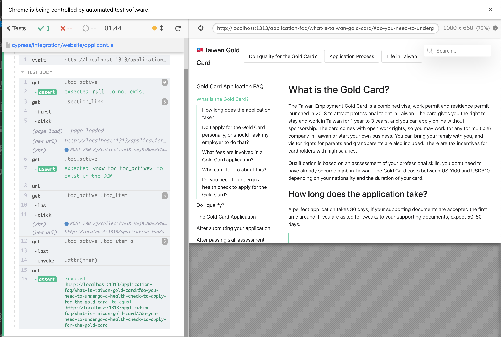

## Communication

We use [slack](https://goldcardcommunity.slack.com/) for talking about all `#website` matters.

## Content Editors

Please join the slack channel above. We will give you access to a CMS to edit content / create new posts.

If you are comfortable with git, then you can go to [`content` ](https://github.com/taiwangoldcard/website/tree/master/content) folder and edit the pages. Afterwards, raise a Pull Request (see below).

## Developers

1. Feel free to contribute code by raising a [Pull Request](https://github.com/taiwangoldcard/website/pulls). Keep your code change as light as possible, with [atomic commits](https://coderwall.com/p/jmqp0a/why-and-how-i-craft-atomic-commits-in-git) so the whole thing is easier to review.

2. Alternatively, use the [issues](https://github.com/taiwangoldcard/website/issues) page to raise ideas / suggestions.

### Code structure

- Content: `content/` -- Most copy should be edited here.
- HTML: `themes/compose/layout/` -- is where you want to modify the layout
- JS: `themes/compose/assets/js/` -- is where you want to modify or add new JS functionality
- CSS: `themes/compose/assets/sass/` -- is where is the styles are. `hugo` will automatically translates it to CSS

- Output: `docs/` is the "build" folder, where GitHub look at to show the [Taiwan Gold Card](https://taiwangoldcard.com/) website

### Tests

We have frontend tests (with cypress) to check if the website still works properly before being available on the website. All tests are ran automatically via [github workflows](./workflows/tests.yml) when you push a commit. You can see them [here](https://dashboard.cypress.io/projects/rtyzr7/runs). Each test has a video attached to it.

If you need to run the tests locally:

1. First, install node / npm. This is required for the test executable. You may use [Node Version Manager](https://github.com/nvm-sh/nvm):

```
curl -o- https://raw.githubusercontent.com/nvm-sh/nvm/v0.35.3/install.sh | bash
```

2. At this repo's root, perform `npm install`. This will install `cypress`, the automated test runner.

3. Run the application `npm start`.

4. Run the tests `npm test`.

5. (Optional) To debug tests, you can `./node_modules/cypress/bin/cypress open` to view the interactive UI and select the tests to run:



### Deploy changes

When you push to master (or merge a Pull Request), a [github action workflow](https://docs.github.com/en/actions/reference/workflow-syntax-for-github-actions) will be automatically called, and deploy your changes to the website.

You can see how it works in the [deploy workflow](./workflows/deploy.yml)
